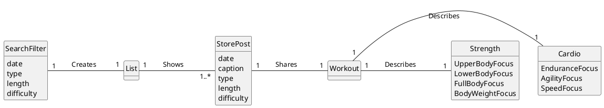
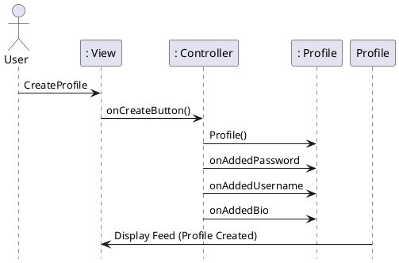
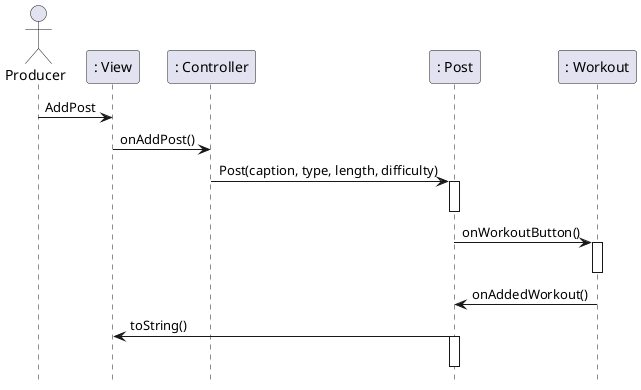
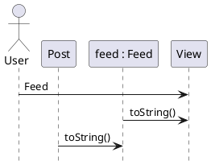
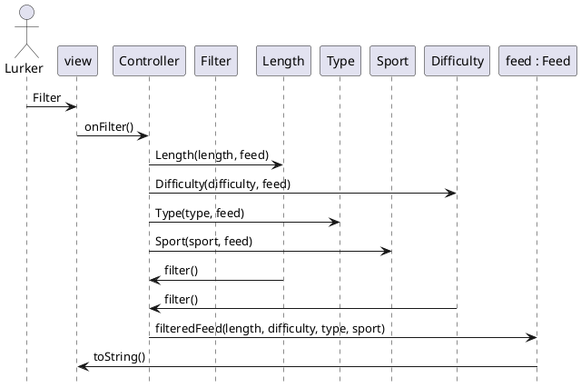
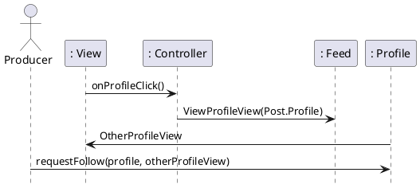
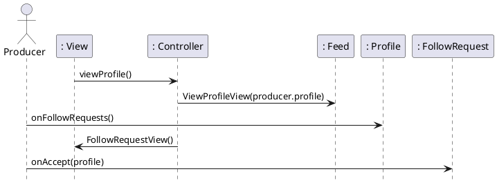
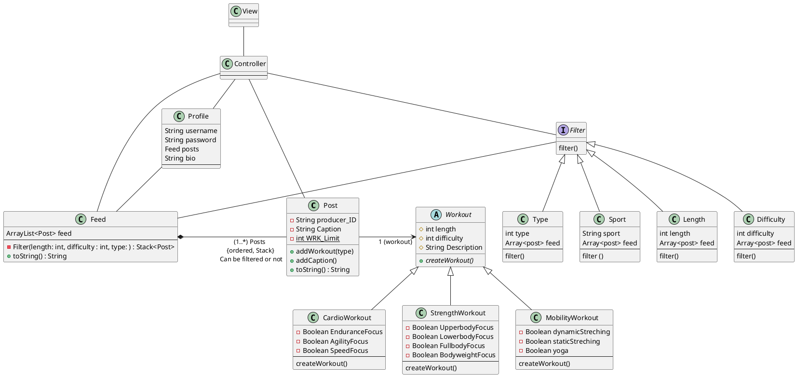

## Domain Model

# Sequence Diagrams

### Creating a profile:

### Posting a workout:

### Seeing the Feed

### Filtering content

### Following a Profile:

### Accepting a Follow Request:

## Class Diagram 

