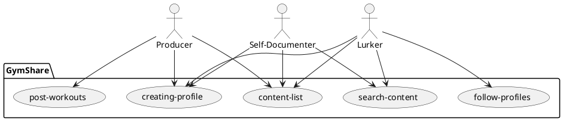

# Social Workout App

### Communication medium - Text, Zoom
### Meeting time - Tuesday, Thursday mornings (Zoom or Sanders)

### Introduction:
We envision an app that allows people around the world to engage in 
a community of fitness enthusiasts that are looking to help each other achieve their fitness goals

### Business Case:
1. Unlike Strava, it is app that has a broader and more complete focus on workouts and fitness
2. Apart from social features, can be an effective and dynamic journal
3. Encourages sharing of all kinds of workouts for every fitness level.

### Key features summary:
- You can post your workouts and your progress in the gym
- Profile with stats and goals 
- Record highest reps/weights accomplished
- Charts or graphs showing progress over time 
- Set goals for future and share progress towards those
- Resource to find workouts of your interest
- Can be filtered to upper-body, lower-body, core etc.
- You could follow people you like and get their workouts
- Can filter to other factors such as workout length or difficulty

### Actors:

Primary actor - Users (All content is user generated)

##Stakeholders goals summary:

### Producers:
- Can create a workout profile with stats, interests, experience, goals
- Can post workout videos, moments, schedules, specific exercises

### Lurkers:
- Can follow people or groups they are interested in and have a feed tailored to interests. 
- Can search for specific workouts of interest through various filters

### Self-Documenter:
- Integrate with third party apps like smartwatches or strava. 
- Backup fitness data

### Bonus features for all users
- Message other users (Maybe)
- Live stream workouts 
- Form workout groups
- Monetize with a subscription
- Leaderboards for friends and groups

